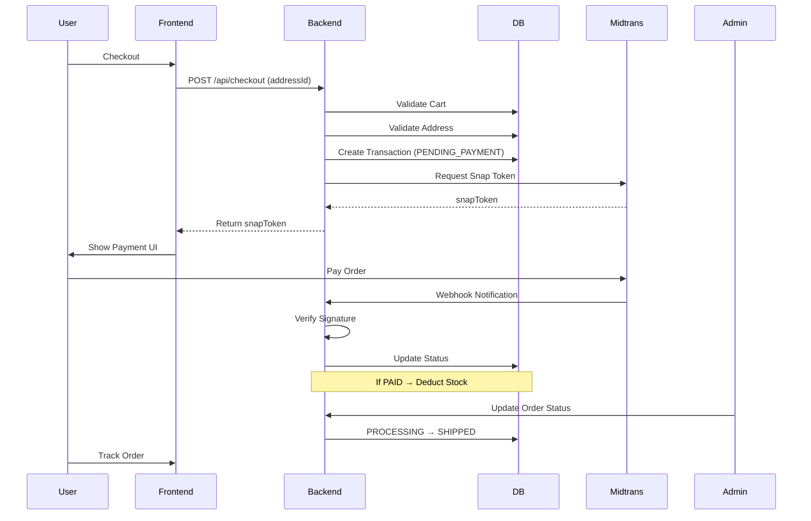

# E-Commerce Transaction Flow (Production Ready)

Dokumen ini menjelaskan alur transaksi lengkap dalam sistem e-commerce dari proses checkout hingga pesanan diterima oleh pelanggan.

Flow ini dirancang agar:

- aman terhadap race condition
- tahan terhadap webhook duplicate
- mendukung fulfillment lifecycle
- scalable untuk production
- mendukung pengiriman barang (shipping)

---

# 1. Cart Stage

User menambahkan produk ke keranjang.

Endpoint:

`POST /api/cart/add`

Data yang disimpan:

`Cart`, `CartItem`

`CartItem` menyimpan:

- `productId`
- `quantity`

Pada tahap ini **stok belum dikurangi**.

Tujuan:

- menghindari stock lock
- memungkinkan user mengubah quantity

---

# 2. Address Management

User harus memiliki **alamat pengiriman (Shipping Address)** sebelum checkout.

User dapat menambahkan alamat melalui endpoint:

`POST /api/addresses`

Data Address:

| Field           | Type   |
|-----------------|--------|
| `id`            | string |
| `userId`        | string |
| `recipientName` | string |
| `phone`         | string |
| `addressLine`   | string |
| `city`          | string |
| `province`      | string |
| `postalCode`    | string |
| `country`       | string |
| `isDefault`     | bool   |

User dapat memiliki **banyak alamat**.

Endpoint untuk mendapatkan alamat saat checkout:

`GET /api/addresses`

---

# 3. Checkout Stage

User menekan tombol checkout.

Endpoint:

`POST /api/checkout`

Payload dari frontend:

```json
{
  "addressId": "string"
}
```

Flow backend:

1. Ambil Cart user
2. Validasi cart tidak kosong
3. Validasi `addressId` milik user
4. Validasi stok semua produk
5. Hitung total harga
6. Membuat Transaction dengan status awal: **`PENDING_PAYMENT`**

---

# Database Operation (Atomic)

Dalam satu database transaction:

- `create Transaction`
- `create TransactionItems`
- attach Shipping Address
- snapshot harga produk

Data yang disimpan:

**Transaction:**

| Field         | Type     |
|---------------|----------|
| `id`          | string   |
| `userId`      | string   |
| `addressId`   | string   |
| `totalAmount` | number   |
| `status`      | enum     |
| `snapToken`   | string   |
| `paymentUrl`  | string   |
| `createdAt`   | datetime |

**TransactionItem:**

| Field           | Type   |
|-----------------|--------|
| `productId`     | string |
| `quantity`      | number |
| `priceSnapshot` | number |

Cart kemudian **dikosongkan**.

---

# 4. Payment Initialization

Backend meminta token pembayaran dari Midtrans.

**Midtrans Snap API** dipanggil.

Response:

- `snapToken`
- `paymentUrl`

Token disimpan di database.

Response ke frontend:

```json
{
  "snapToken": "...",
  "paymentUrl": "..."
}
```

---

# 5. Payment Stage

Frontend membuka UI Midtrans:

```js
window.snap.pay(snapToken)
```

User memilih metode pembayaran:

- QRIS
- GoPay
- OVO
- ShopeePay
- Bank Transfer
- Credit Card

Status order masih: **`PENDING_PAYMENT`**

---

# 6. Midtrans Webhook

Midtrans akan mengirim webhook:

`POST /api/webhook/midtrans`

Backend melakukan:

1. **Signature Verification**
2. **Idempotency Check**
3. **Status Update**

---

## Signature Verification

Backend memverifikasi `signature_key` untuk memastikan webhook berasal dari Midtrans.

```
SHA512(order_id + status_code + gross_amount + server_key)
```

---

## Idempotency Check

Untuk mencegah webhook diproses dua kali.

```
if transaction.status == PAID → ignore webhook
```

---

## Payment Status Mapping

| Midtrans Status | System Status     |
|-----------------|-------------------|
| `settlement`    | `PAID`            |
| `capture`       | `PAID`            |
| `pending`       | `PENDING_PAYMENT` |
| `cancel`        | `CANCELLED`       |
| `deny`          | `FAILED`          |
| `expire`        | `EXPIRED`         |

---

# 7. Stock Deduction

Stok produk **baru dikurangi ketika pembayaran berhasil**.

Trigger:

> `status → PAID`

Operation:

```
update product.stock -= quantity
```

Dilakukan dalam **database transaction**.

Tujuan:

- menghindari stock lock
- memastikan stok hanya berkurang jika pembayaran valid

---

# 8. Order Fulfillment

Setelah pembayaran berhasil, status berubah menjadi `PAID` dan order masuk ke proses fulfillment.

Lifecycle order:

```
PAID → PROCESSING → PACKING → SHIPPED → DELIVERED
```

---

# 9. Shipment Data

Saat status berubah menjadi `SHIPPED`, sistem menyimpan data pengiriman.

**Shipment:**

| Field               | Type     |
|---------------------|----------|
| `id`                | string   |
| `transactionId`     | string   |
| `courier`           | string   |
| `trackingNumber`    | string   |
| `shippingCost`      | number   |
| `shippedAt`         | datetime |
| `estimatedDelivery` | datetime |

Endpoint:

`PATCH /api/admin/transactions/{id}/ship`

---

# 10. Admin Operations

Admin dapat melihat semua order.

`GET /api/admin/transactions`

Admin dapat memperbarui status order.

`PATCH /api/admin/transactions/{id}`

Transisi yang valid:

```
PAID → PROCESSING → PACKING → SHIPPED → DELIVERED
```

---

# 11. Expired Payment

Jika user tidak menyelesaikan pembayaran, Midtrans mengirim `expire`.

Status order berubah: **`EXPIRED`**

> Karena stok **belum dikurangi**, tidak perlu pengembalian stok.

---

# 12. Cancelled Payment

Jika pembayaran dibatalkan, status berubah: **`CANCELLED`**

Order dianggap gagal.

---

# 13. Refund Handling (Future)

Jika order sudah `PAID` tetapi dibatalkan:

Status: **`REFUNDED`**

Flow:

```
Admin request refund
↓
Call Midtrans Refund API
↓
Update status REFUNDED
```

---

# Order Status Lifecycle

**Normal flow:**

```
PENDING_PAYMENT → PAID → PROCESSING → PACKING → SHIPPED → DELIVERED
```

**Exception Status:**

- `FAILED`
- `CANCELLED`
- `EXPIRED`
- `REFUNDED`

---

# Sequence Diagram


